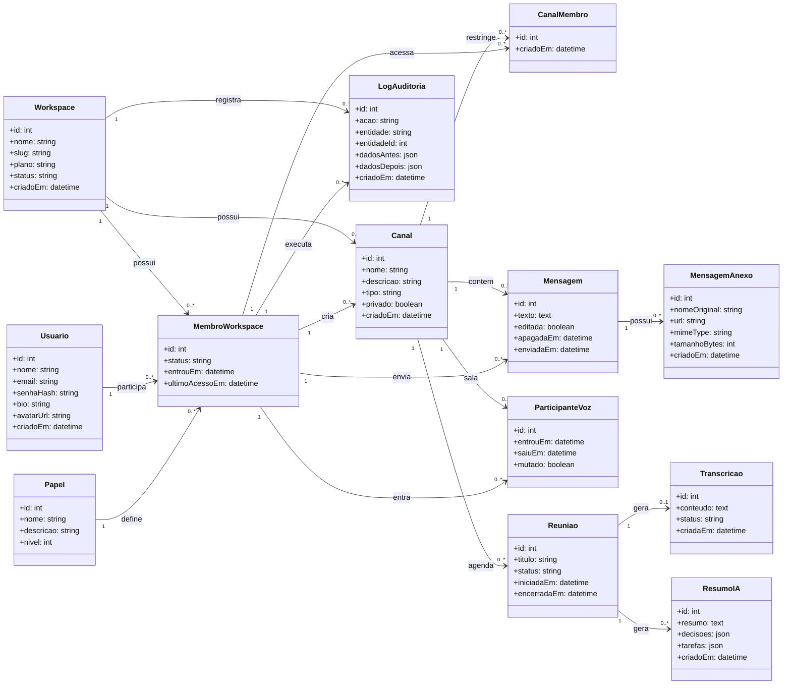

# Modelo de Classes - Beehive

Este documento adapta o modelo de classes usado em aula para o domínio do Beehive. A ideia é servir como ponte entre a documentação de Engenharia de Software e a estrutura futura do banco de dados.

O modelo abaixo deixa a IA fora do escopo imediato, mas mantém uma área futura para reuniões, transcrições e resumos automáticos.

## Como Ler

- `Usuario` representa a pessoa que acessa a plataforma.
- `Workspace` representa a empresa ou ambiente corporativo.
- `MembroWorkspace` é uma classe associativa entre `Usuario` e `Workspace`. Ela guarda o papel do usuário dentro daquela empresa.
- `CanalMembro` é uma classe associativa usada principalmente para canais privados.
- `MensagemAnexo` separa arquivos da mensagem, evitando que a tabela de mensagens fique carregada com campos opcionais.
- `LogAuditoria` registra ações relevantes para rastreabilidade e apresentação de boas práticas.

## Diagrama

## Classes Principais

### Workspace

Representa a empresa ou ambiente corporativo. Mesmo que o MVP use apenas uma empresa, esta classe prepara o sistema para funcionar como SaaS.

Campos importantes:

- `nome`: nome exibido da empresa.
- `slug`: identificador amigável, por exemplo `empresa-x`.
- `plano`: plano contratado ou plano acadêmico/demonstração.
- `status`: ativo, suspenso ou arquivado.

### Usuario

Representa a conta de autenticação. Não deve guardar o cargo diretamente, porque o cargo depende do workspace.

Campos importantes:

- `email`: único no sistema.
- `senhaHash`: senha criptografada com bcrypt.
- `bio` e `avatarUrl`: dados de perfil.

### MembroWorkspace

Representa a participação de um usuário em uma empresa. Esta é uma classe associativa, parecida com uma tabela intermediária mais rica.

Exemplo:

- Igor pode ser `admin` no Workspace Beehive.
- Outro usuário pode ser `moderador`.
- No futuro, o mesmo usuário poderia participar de mais de um workspace com papéis diferentes.

### Papel

Representa papéis de acesso, como:

- `usuario`
- `moderador`
- `admin`

No futuro, pode evoluir para permissões granulares.

### Canal

Representa o canal de comunicação. Pertence a um workspace e pode ser público ou privado.

Campos importantes:

- `tipo`: texto, voz, reunião ou anúncio.
- `privado`: define se exige membros explícitos em `CanalMembro`.

### CanalMembro

Define quais membros podem acessar um canal privado.

Regra recomendada:

- Canal público não precisa de registros nessa tabela.
- Canal privado deve permitir acesso apenas a membros registrados nela, além de admins/moderadores conforme regra do sistema.

### Mensagem

Representa uma mensagem enviada em um canal.

Melhorias em relação ao banco atual:

- `editada`: permite indicar edição futura.
- `apagadaEm`: permite soft delete, preservando auditoria.
- Arquivos saem da tabela e vão para `MensagemAnexo`.

### MensagemAnexo

Representa arquivos enviados em uma mensagem.

Vantagem:

- Uma mensagem pode ter zero, um ou vários anexos.
- O histórico de mensagens fica mais limpo.

### ParticipanteVoz

Representa entrada e saída de um membro em um canal de voz.

No banco atual, a tabela `salas_voz` guarda presença atual. Este modelo permite guardar histórico se desejarem.

### LogAuditoria

Registra ações importantes:

- criação de canal;
- exclusão de canal;
- alteração de cargo;
- entrada/saída de canal privado;
- exclusão de mensagem;
- tentativas negadas de acesso.

Esta classe ajuda muito na apresentação, porque se conecta diretamente aos requisitos de rastreabilidade, segurança e governança.

## Área Futura

Estas classes ficam preparadas para quando o grupo retomar a IA:

- `Reuniao`: reunião associada a um canal.
- `Transcricao`: transcrição de áudio ou reunião.
- `ResumoIA`: resumo, decisões e tarefas extraídas.

Elas não precisam ser implementadas agora para a migração do banco.

## Mapeamento Para Tabelas

| Classe | Tabela sugerida | Observação |
| --- | --- | --- |
| Workspace | `workspaces` | Nova tabela. |
| Usuario | `usuarios` | Já existe, mas deve remover `cargo` e talvez `status` no futuro. |
| Papel | `papeis` | Nova tabela para cargos. |
| MembroWorkspace | `workspace_membros` | Nova tabela para cargo/status por empresa. |
| Canal | `canais` | Já existe, mas deve ganhar `workspace_id`, `tipo` e `criado_por_id`. |
| CanalMembro | `canal_membros` | Já existe, mas pode referenciar `workspace_membros`. |
| Mensagem | `mensagens` | Já existe, mas pode ganhar `editada`, `apagada_em` e trocar autor para membro. |
| MensagemAnexo | `mensagem_anexos` | Nova tabela para uploads. |
| ParticipanteVoz | `voz_participantes` | Substitui ou evolui `salas_voz`. |
| LogAuditoria | `auditoria_logs` | Nova tabela. |
| Reuniao | `reunioes` | Futuro. |
| Transcricao | `transcricoes` | Futuro. |
| ResumoIA | `resumos_ia` | Futuro. |

## Decisões De Engenharia

1. Cargo não fica em `Usuario`.

   O cargo pertence ao vínculo entre usuário e empresa. Isso melhora o modelo SaaS e evita limitação futura.

2. Anexo não fica dentro de `Mensagem`.

   Uma mensagem pode ter vários anexos. Separar melhora normalização e facilita evolução.

3. Canal privado usa associação própria.

   `CanalMembro` controla acesso sem misturar lógica diretamente na tabela de canais.

4. Auditoria é tabela própria.

   Isso ajuda em rastreabilidade, segurança e conformidade com LGPD.

5. IA fica em classes futuras.

   O modelo continua coerente com a documentação, mas o desenvolvimento atual fica focado em banco, segurança e organização.

## Prioridade Para Implementação

1. Criar `workspaces`, `papeis` e `workspace_membros`.
2. Migrar `usuarios.cargo` para `workspace_membros.papel_id`.
3. Adicionar `workspace_id` em `canais`.
4. Criar `mensagem_anexos` e migrar campos de arquivo de `mensagens`.
5. Criar `auditoria_logs`.
6. Evoluir `salas_voz` para `voz_participantes`, se vocês quiserem histórico.
7. Deixar `reunioes`, `transcricoes` e `resumos_ia` para outra etapa.
